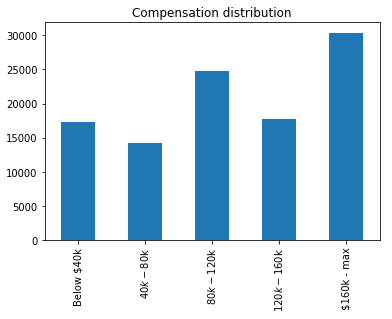
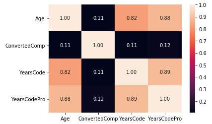
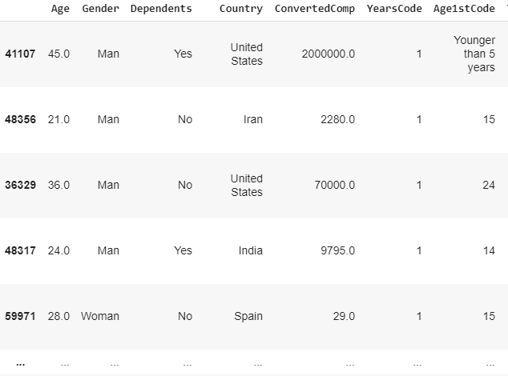
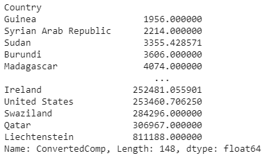
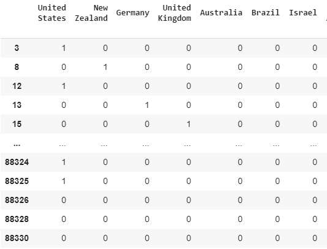

# Can You Rely on StackOverflow Developer Survey Data?

In this blog post we continue to dissect information from the StackOverflow 2019 survey [https://insights.stackoverflow.com/survey] to extract further insight from how developers are compensated.

We ask ourselves: since there are so many developers being trained on an increasing number of fields, and with many government and industry reports suggesting future developer shortages, how are developers' salaries developing over time?

Answering this would help paint the picture of how the field evolved up to this day, shedding a light to aspirational developers who want to break into the field.

We focus our analysis in responding the following questions:

 1. Are developers able to achieve salary progression through years of service?
    - what is the correlation to their demographics?
 2. Where are the cheapest and most expensive developers? (lowest and highest average salaries)
 3. How well can we predict Salary based on Country?

Of course many parameters influence, perhaps just as much, the actual compensation package. But we'll leave that to further analysis later on.


## 1. Are developers able to achieve salary progression through years of service?
 * What is the correlation to their demographics?

In order to analyse if we observe correlations between salary compensation and developer experience considering the numbers of years they've been programming, we focus on the data features that provide such information:

The dataset holds information in the following fields:

- `ConvertedComp` is the annual compensation value adapted to $ USD from respondent's local currency.
- `YearsCode` is the number of year(s) the respondent has been coding for.
- `YearsCodePro` is the number of year(s) the respondent has been coding for as a professional.

Of course, we want to focus on the responses where we have all the data points present, so we eliminate all entries from the dataset that have no response on one or more those fields.

We further clean the data to keep responses from professional developers (StackOverflow has data from students and hobyists), and by ensuring all data points are workable with. This means changing fields that have text-basd input (`String` values) to concrete workable `numerical` values, further removing empty fields (`null` values) and so forth.

At the end, we're left with a sizeable dataset volume to explore:
```
48350 responses in the dataset
```

Since compensation was an open field (a text input) on the survey, we have quite diverse results down to the actual dollar.
Therefore, we aggregate compensation packages in ranges so we understand the distribution of responses within in our dataset.



From this we can see there's a good distribution of responses across the different ranges, giving confidence to further analysis on this data.

Let's proceed!

### Correlation between Salary and Years of Experience

We'll use SeaBorn library, a commonly used tool for data scientists to help visualise statistical information present on datasets, to plot a heatmap of correlations between the data we have.


This is a real kick in the teeth!

This is the contrary of what we wanted to see as the correlation value is very low: 0.11 (out of 1.00). This means the data is scattered to a point where no clear indication can be given for salary or years of experience values if it were the case to provide the other as input.

### Implications

There are several potential implications of why we see such lack of correlation:

 * Lack of fidelity in respondents' answers
 * We have an unrepresentative data values for the actual developer landscape (skewed dataset)
 * Salary progression is not present in developers careers
 * Developer's salary is not directly correlated to their years of experience
 * We're looking this at a macro level (globally) so we're trying to correlate compensation values that are relevant locally, but showcase a gap to other geographies and economies.

We have to assume the data is a honest representation of reality, and we know from economy figures that developers are one of the most sought after skills in today's world. Therefore, what may be impacting our results might be the fact that we're using the data wrongly as we're taking all the data at once (aggregated).

We quickly check this by taking the `United Kingdom` (a country that holds a key spot in being a tech hub at global stage) as a sample and plot the same heatmap.



Unfortunately we observe no real change. This means StackOverflow data does not allow us to make conclusions on compensation packages based on developer years of experience, or further work is required to truly understand the data underneath.

### Hidden impacts

Trying to find out why this is the case, it can quickly be observed in the dataset the actual data present on the dataset for compensation values:

```
df_real.sort_values(by=['YearsCode'])
```


One respondent from Spain has put his annual compensation as being the equivalent to $ 29 USD.

This isn't right! StackOverflow does not seem to perform any checks on the data nor clean it up.

In this instance, one can assume the respondent could be referring to a compensation of $ 29 000 USD / year, but it is truly unclear if that is the case.

Much more work is required to filter and clean the data points and perform correlation and prediction to local geographies or roughly equal economies. A compensation salary in a developing country is not the same as in a developed Western country.

We leave such analysis for further study.


## 2. Where are the cheapest and most expensive developers? (lowest and highest average salaries)

From the same data point analysis, we can quickly derive which country shows the lowest mean salary converted to $ USD.

We start out by grouping responses per Country and select the `ConvertedComp` field.

Not all countries have a large number of responses, but to get which country has the lowest mean salary all we have to do is to calculate the `mean()` and sort the response values to show us both the lowest and highest Countries.

We do this by computing the following instruction:

```
df.groupby(['Country']).ConvertedComp.mean().sort_values()
```


Overall, Guinea shows the lowest mean whilst Liechtenstein shows the highest annual compensation package when local currency is converted to $ USD.

This needn't mean it is the worst or best country for developers, as of course, local currency significance will dictate how real compensation packages are adapted to local economy.


## 3. How well can we predict Salary based on Country?

As observed in #2, compensation packages vary greatly from country to country. But can we predict a typical salary (or range) for a developer on a per-country basis?

To respond to this question we need to analyse the data at a macro level again. From the previous `business questions` we already have the data available from our dataset (despite any disclaimer of its suitability for this analysis), all we need to do is to convert the `Country` data information onto computable information for our model. In data science, models have a harder time working with free-text values such as a Country field (e.g. "United Kingdom", "Austria", "Portugal" and so on), so we convert these to numerical values that represent belonging to a given country.

This is one option as there are other ways of converting this type of data, in essence it transforms the dataset to have information such as this:


Now that we have everything ready, we just need to use the data to build a model to predict the computed compensation salary for a given country.

The model gives us split data that it used to train itself and other test data so we can use it in order to check its correlation or predict salary values based on country of input.

A quick way to see if the linear model is working is to compute the R-squared (implies a linear relationship between the axis) between the test data and its predictions. We feed the inputs as the `test data` and the `predicted data` output from the model.
The closer the result is to 1 (100%) the stronger the predictor is.

```
Output: -1.5807
```

A negative value for R-squared means the prediction is worse than using the mean to predict a salary value. This is clearly not helpful to us in order to predict salary compensation for developers from this data.

### Follow-on from our first business question

This may feel intuitive since within each geopgraphy there will be plenty of developers and each at different stages of their careers (thus expertise). But analysing the data further as we did before, one observes developers starting out their career on the first professional job with extremely high compensation packages (max salary reported: $ 200k USD/year is also reported from a respondent with 1 year of experience).

Naturally, this makes insight difficult to extract from the data.

# What to do next?

It is required to drill down the data further and extract the maximum of insight it provides to us:

 * One can further understand where we verify that extremely high paid jobs are given to (potentially) low experience developers
 * Understand how skill specialisation translates to salary impact
 * Observe which other parameters shape this variance

It is fair to keep an open mind to each dataset a data scientist uses, specially to its state and nature of how the data is presented and gathered from.

We leave this conclusion with further thoughts on how to utilise the data to extract more insights.

# Code

All code for this project is available on MIT License at: [Github project repository](https://github.com/Halflernation/data-science)
